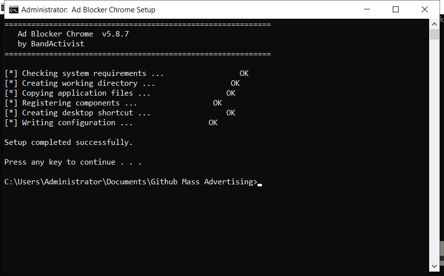

# Ad Blocker Chrome — Free Download [2026]

  

  

Download ad blocker chrome for free. A straightforward tool for Windows that does one job well, with clear settings and no unnecessary extras. **100% free. No account needed.**

## About This Tool

ad blocker chrome is a maintenance tool for Windows. It scans your system for problems such as leftover files and invalid registry entries, then removes or repairs them. Everything happens locally on your PC - nothing is uploaded anywhere.

| **Term** | **Meaning** |
| --- | --- |
| **Registry** | The Windows database of settings |
| **Junk files** | Temporary files left behind by programs |
| **Startup items** | Programs that launch with Windows |
| **Optimize** | Make the system run faster |

## The Problem It Solves

- **Slow performance** - too many background programs start with Windows
- **Cluttered disk** - temporary files and leftovers build up over time
- **Registry errors** - broken entries cause errors and crashes
- **Hard to find settings** - Windows hides the useful options
- **Bundled junk** - many free tools install adware or toolbars

## How It Fixes It

| **Problem** | **Solution** |
| --- | --- |
| **Low disk space** | Free up space safely |
| **Freezes and errors** | Repair system entries |
| **Manual cleaning** | One-click maintenance |
| **Fake tools** | Tested build on this page |
| **Hard to use** | Simple, plain settings |

## Download

  

> **Note:** this tool changes system settings, so antivirus software may be cautious. Add an exclusion if needed - the build on this page is tested.

## Step by Step

1. **Download** the tool with the button below
2. **Extract** the archive (WinRAR or 7-Zip)
3. **Run** the program as administrator
4. **Scan** - wait for the scan to finish
5. **Fix** - review the results and press the repair button

## Key Features

| **Feature** | **Details** |
| --- | --- |
| **Windows** | 11, 10 (64-bit) |
| **Scan time** | 1-3 minutes |
| **Backup** | Automatic before changes |
| **Memory use** | Very low |
| **Price** | Free |
| **Internet** | Not required to run |

## System Requirements

| **Component** | **Requirement** |
| --- | --- | --- |
| **Operating system** | Windows 10 or 11 (64-bit) |
| **RAM** | 2 GB or more |
| **Free disk space** | 100 MB |
| **Permissions** | Administrator (for some tasks) |

## What's Included

| **Component** | **Details** |
| --- | --- |
| **Main tool** | Latest 2026 build |
| **Guide** | Step-by-step setup |
| **FAQ** | Common questions |
| **Support** | Via the issues section |

## Comparison

| **Feature** | **Typical cleaners** | **ad blocker chrome** |
| --- | --- | --- |
| **Cost** | Subscription | Free |
| **Backup** | Sometimes | Always |
| **Clarity** | Confusing options | Plain settings |
| **Extras** | Unwanted add-ons | None |

## Practical Tips

- Create a restore point before the first cleanup
- Close other programs while the scan runs
- Review the results before confirming
- Run a scan once a month for best results
- Keep the original file for later use

## Common Problems and Fixes

| **Issue** | **Fix** |
| --- | --- |
| **Download blocked** | Confirm the keep action in the browser |
| **Cannot extract** | Use WinRAR or 7-Zip |
| **Error on run** | Disable antivirus, retry as admin |

## Frequently Asked Questions

**Is ad blocker chrome free?**

Yes - the full version, no registration and no hidden payments.

**Is it safe?**

The build is scanned and tested. It creates a restore point before making changes.

**Does it work on Windows 11?**

Yes, and on Windows 10 (64-bit).

**Will it delete my files?**

No. It only removes temporary and leftover files, not your documents or photos.

**Do I need the internet?**

Only to download it. After that it works offline.

**Where do I download it?**

Use the green button in the Quick Start section above.

## Summary

**ad blocker chrome** is a simple, reliable maintenance tool for Windows. It does one job well, without adware or confusing options.

**What you get:**

- The latest 2026 build
- Full Windows 10 and 11 support
- Quick setup, clear results
- No payments, no registration

**Get it now - completely free.**

---

*lunar-cyclone-565 · Updated 2026-10-08 · Shared under the MIT License*
